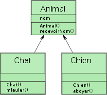

# Cours PHP

### Declaration d'un tableau

Pour declarer un tableau, on utilise le syntaxe suivant:

```php
<?php
	$tab = ["Raph", 5, -14, "Salut", ["Lundi", "Mardi", "Mercredi"]];
	$nom = ["Koto", "Rabe", "Randria"];
	$personnes = [
        "president" => "Andry Rajoelina",
        "premier ministre" => "Ntsay Christian"
    ];
    $eleves = [
        [
            "nom" => "Koto",
            "note" => 18
        ],
        [
            "nom" => "Rabe",
            "note" => 8
        ],
        [
            "nom" => "Randria",
            "note" => 12
        ],
    ];
    
?>
```

### Affichage de tableau

Pour afficher un tableau, on utilise le syntaxe suivant:

```php
<?php
    echo $tab[1] // Afficher l'element 2 dans tab
    echo $personnes["president"] // Afficher l'element qui a la cle president
    echo $eleves[2]["nom"]; // Afficher Le nom de l'element 3 du tableau eleve 
?>
```

Pour parcourrir un tableau, on utilise le boucle foreach:

```php
<?php
    foreach($eleves as $key => $eleve){
        var_dump($eleve);
    }

    for($i = 0; $i < count($eleves); $i++){
        var_dump($eleves[$i]);
    }
```

Exemple de creation d'un table avec php
```php
<table>
    <tr>
        <th>Nom</th>
        <th>Prenom</th>
    </tr>
    <?php foreach($eleves as $eleve):?>
    <tr>
    	<td><?=$eleve["nom"];?></td>
    	<td><?=$eleve["note"];?></td>
    </tr>
    <?php endforeach?>
</table>
```


### Récupération des données dans une base de donnée

Pour acceder à la base de donnée, nous allons utiliser pdo_mysql;

Pour initier la connection à la b.d.d, on utilise la fonction pdo()

```php
<?php
    try{
    	$myDatabase = new PDO("mysql:dbname=database;host:localhost","user_mysql", "password");        
    } catch($PDOExeption $e) {
    	echo "Connection faild " . $e->getMessage();   
    }
?>
```

#### Méthodes dans le model PDO

```php
<?php 
    PDO::exec("SQL syntaxe") // Retourne le nombre de ligne affectee
    PDO::query("SQL sytaxe") // 
    PDO::prepare("SQL syntaxe") // This will return an PDOStatement
    PDOStatement::execute() // This will execute the previously SQL code
    PDOStatement::fetch() // This function will return an array of the content of the database
?>
```


# POO en Php
### C'est quoi Poo?
Programmation Orienté Objet

Une classe décrit la structure interne des données et elle définit les méthodes qui s'appliqueront aux objets de même famille (même classe)

Un objet est une instance d'une classe.


### Syntaxe
La declaration d'une classe en php s'ecrit comme suit:

```php
<?php
// Declaration de la classe
class Personnage {
    private $firstName;
    private $lastName;

    public function __construct($firstName, $lastName){
        $this->firstName = $firstName;
        $this->lastName = $lastName;
    }

    public function getFirstName(){
        return $this->firstName;
    }

    public function getLastName(){
        return $this->lastName;
    }

    public function setFirstName($firstName){
        $this->firstName = $firstName;
    }
}

?>
```

### Exemple de POO - Implementation d'un mini RPG

Dans cette exemple, on va créer un petit système de RPG; on va donc créer deux classes: Personnage et Armes.

Le concepte du jeu est simple:

1. La classe Arme:

La classe Arme est constituée de deux attributs: **le nom de l'arme** et **le degat apportée par l'arme**

La classe Arme a 5 methodes: **upgrade**, les **2 accesseurs** et les **2 muttateurs**.

Upgrade permet d'augmenter le degat apportée par l'arme

Les accesseurs permettent d'obtenir les valeurs des attirbuts tandis que les muttateurs pour changer les valeurs des attributs.

2. La classe Personnage:

La classe Personnage a trois attributs: **nom**, **point de vie**, et **arme**(c'est une instance de l'objet Arme)

La classe a 4 methodes(a part les accesseurs et les muttateurs): **attaquer**, **status**, **regenerer**, **upgrade_vie**, **upgrade_arme**


Forme de la status:

| Status | Valeur |
| ------ | ------ |
| Nom    |        |
| Vie    |        |
| Arme   |        |

### Exemple 2 - La classe Database

Dans cette exemple, on va creer une classe Database qui va gerer la connection a notre base de donnees:

Donc, cette classe va contenir un objet PDO, qui represente notre base de donnees. Et elle aura des methodes qui permettent d'obtenir l'objet PDO pour faire des requettes.

```php
<?php
class Database{
    public function __construct($db_name, $db_host, $db_user, $db_password){
		try{
            $this->pdo = new PDO("mysql:dbname=$db_name;host:$db_host",$db_user, $db_password);
        } catch(Exception $e) {
            die("Error " . $e->getMessage());
        }
    }
	
    public function getPDO(){
        return $this->pdo;
    }
    
    private PDO $pdo;
    

}
?>
```


### Statique

Une classe statique est une classe qui n'a pas besoin d'etre instancier. L'interet des classes statiques est qu'on ne gaspille pas de memoire a creer des objets en accedant directement à leur methodes

Exemple:

On va creer une classe Config qui va contenir tous les configuration de notre base de donées

```php
<?php
    
define("CONFIG_FILE", "./config.php");
class Config{
	private static $settings;
    
    
    private function __construct($fileName){
        $settings = require($fileName);
    }
    
    public static function get($key){
        if (is_null(self::$settings))
            self::$settings = require(CONFIG_FILE);
        if(!isset(self::$settings[$key]))
            return null;
       	return self::$settings[$key];
    }
}
```


Ensuite, on va transformer notre classe en une classe database en classe statique car on a vraiment pas besoin d'instancier cette classe. On va aussi utiliser notre classe Config precedent dans notre nouvelle classe. Ainsi, on va parler de la statique.


```php
<?php
class Database{
    public function __construct(){
        $db_name = Config::get("db_name");
        $db_host = Config::get("db_host");
        $db_user = Config::get("db_user");
        $db_password = Config::get("db_password";)
		try{
            $this->pdo = new PDO("mysql:dbname=$db_name;host:$db_host",$db_user, $db_password);
        } catch(Exception $e) {
            die("Error " . $e->getMessage());
        }
    }
	
    public static function getPDO(){
        if(is_null(self::$pdo))
            self::$pdo = new Database(); 
        return self::pdo;
    }
    
    private static PDO $pdo;
    

}
?>
```

### Héritage

En [programmation orientée objet](https://fr.wikipedia.org/wiki/Programmation_orientée_objet), l’**héritage** est un mécanisme qui permet, lors de la [déclaration](https://fr.wikipedia.org/wiki/Déclaration_(informatique)) d’une nouvelle [classe](https://fr.wikipedia.org/wiki/Classe_(informatique)), d'y inclure les caractéristiques d’une autre classe.

Exemple:



